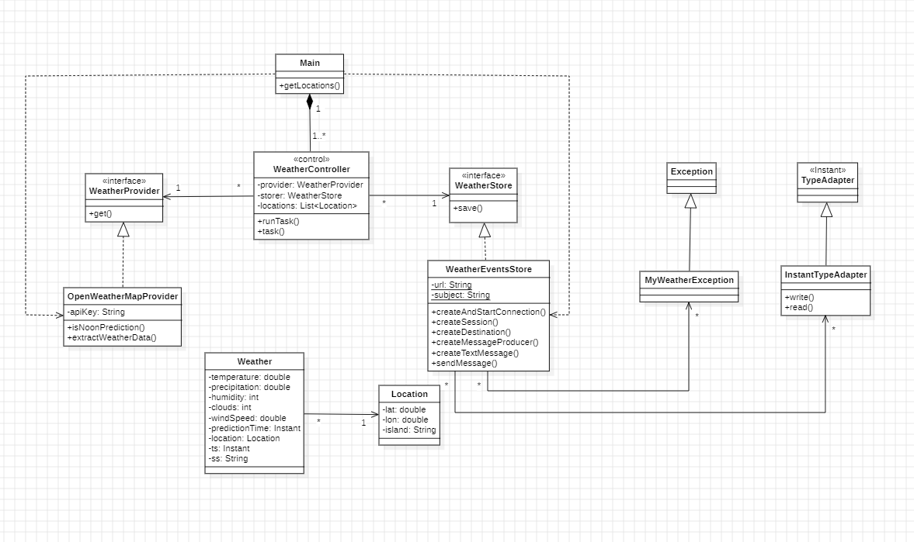
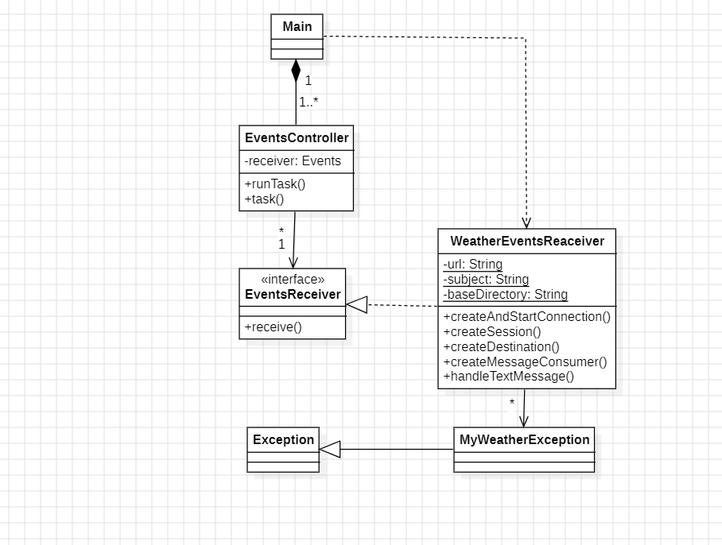

# Practice 1: Data Capture from External Sources.

- **Subject:** *Development of Applications for Data Science*
- **Course:** *Second year 2023-2024*
- **Degree:** *Bachelor's Degree in Data Science and Engineering*
- **School:** *University of Las Palmas de Gran Canaria*

## Summary of Functionality
**An application that makes api calls to a weather information provider (https://openweathermap.org/api) and generates an event through the obtained information, storing it in a topic in a broker call ActiveMQ (https://activemq.apache.org/). Subsequently, a subscriber receives the events and stores them in a directory.**

## Resources Used
- **Development Environments:** *IntelliJ*
- **Broker:** *Activemq*
- **Version Control Tools:** *GIT and GITHUB Repository*
- **Documentation Tools:** *Star UML and Markdown document*

## Design
I divided the application into two child modules called "weather-provider" and "events-store-builder," both children of the parent module of the application named "WeatherApp." The goal was to have two modules responsible for different tasks. Firstly, the information provider makes API calls to a server and receives meteorological information, creating events that are stored in a topic in the relevant broker. Secondly, the events storer is responsible for receiving and storing events in a directory, displaying the source and date of the prediction.

The first module was divided into two packages: "control," responsible for managing information and business logic, and "model," where the business logic resides. There is no view due to the autonomous nature of the application. The second module simply has a control package that manages messages received by the broker and stores events in a directory anchored to the project's root directory.

On the other hand, I used controllers that could be defined as adapters for the functions and implementations of the code, so that the user's experience is not contaminated, and they do not need to be aware of the code implementations to use the application. Then, I made use of interfaces that encourage code modularity, reducing coupling. These interfaces and their implementations act as ports to the business logic, indicating how data should be processed. Finally, to further reduce coupling, I used my own exceptions so that the interface is not contaminated by the implementations.
### Class Diagram
**
**

### Dependency Relationships
There are different relationships, but the first thing to note is that the receiving module and the sending module are not related to each other since they are not interconnected except through their parent module. Then, in the "provider," there is a main that is related to a controller; this main executes the two implementations of the interfaces, avoiding interdependencies. The only dependency that exists is between the "Weather" class and the "Location" class, as well as the class making the call. The second module, the "events-store-builder," also has a main that executes a controller, and this controller, in turn, implements an interface. As for exceptions, there is no dependency because I have created my own exception.
### Important notes
It is needed to download the application via zip or using a vcs, in case you download the zip store it and unzip it if needed where you want to store it, open IntelIJ and open the folder, in case you use VCS open IntellIJ and clone the repository, finally for execution, pass as an argument in command line when you are going to execute the software, the apikey, if not provided the software is not going to execute, also you need to start your broker "activemq".