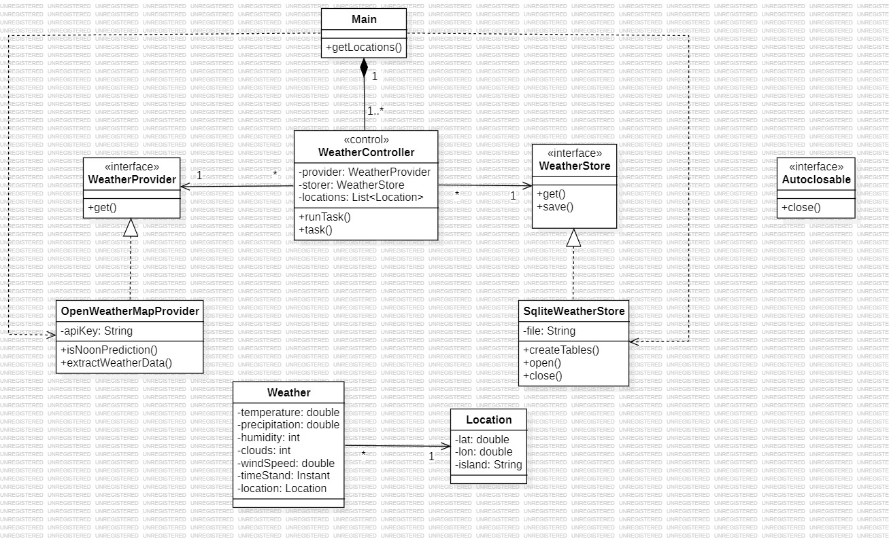

# Practice 1: Data Capture from External Sources.

- **Subject:** *Development of Applications for Data Science*
- **Course:** *Second year 2023-2024*
- **Degree:** *Bachelor's Degree in Data Science and Engineering*
- **School:** *University of Las Palmas de Gran Canaria*

## Summary of Functionality
**An application that makes requests to a meteorological information provider and stores the information in a database. Makes call to an api provided by https://openweathermap.org/api and receive and object from which we get information that I store in a database as an Weather object.**

## Resources Used
- **Development Environments:** *IntelliJ*
- **Version Control Tools:** *GIT and GITHUB Repository*
- **Documentation Tools:** *Star UML and Markdown document*

## Design
I used a model controller design with no vista due to the autonomous nature of the software, with the model containing the implementation of the data and the controller containing the controller class who can see and manipulate the data. I focused on separing the core of the application from the outside so there is no need the user know what is happening and there is no dependency between the core and the outside, guarantying a more scalable logic, so we can extend the classes from the model, also I used interfaces, so I can use different types of providers and storers so there is no domino effect after replacing the implementations of the interfaces. Last I used a command pattern that represent a controller operation called "runTask()" that is executed periodically. In conclusion the main goal is to separate the core to achieve a more scalable logic and the use of the  interfaces and controller so there is no domino effect in the functionality after replacing any part of the application achieving less coupling and more independence between the parts.

### Class Diagram
**

### Dependency Relationships
There are few dependencies, first the provider depends on an interface and is related to a weather class because he creates weather objects, second the weather class depends on location class and cannot exist without a location, third the storer that depends on an interface that also depends on a class call Autoclosable, fourth the controller that is related to the provider and the storer because he makes use of them but doesn't depend on them and lastly the Main that is related to the storer, the controller and the provider cause he creates them but doesn´t depend on them.

### Important notes
It is needed to download the application via zip or using a vcs, in case you download the zip store it and unzip it if needed where you want to store it, open IntelIJ and open the folder, in case you use VCS open IntellIJ and clone the repository, finally for execution pass as arguments in command line when we are going to execute the software, the path of the database and the apikey, if not provided the software is not going to execute.