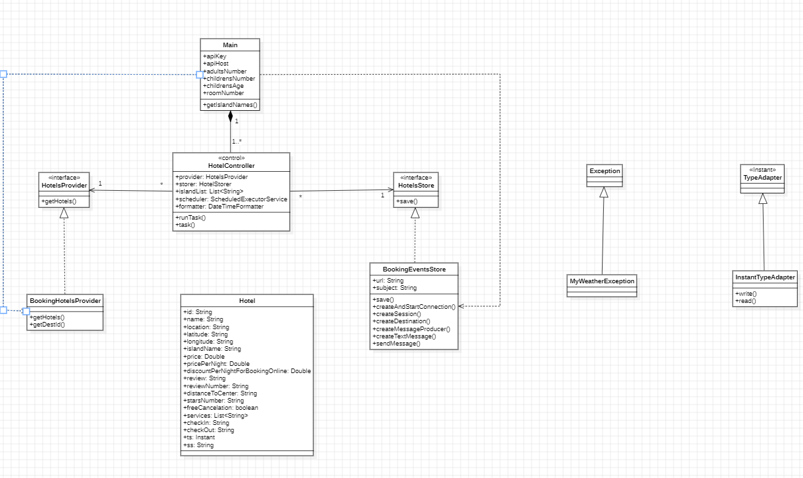

# Practice 1: Data Capture from External Sources.

- **Subject:** *Development of Applications for Data Science*
- **Course:** *Second year 2023-2024*
- **Degree:** *Bachelor's Degree in Data Science and Engineering*
- **School:** *University of Las Palmas de Gran Canaria*

## Summary of Functionality
**The application makes API calls to two different sensors every 6 hours, one being OpenWeatherMap and the other Booking RapidApi. It captures weather and hotel data respectively and then publishes them to two different topics on a broker, in this case, ActiveMQ. Two modules of the application subscribe to these topics: one is responsible for generating the Data Lake, and the other handles the business idea and generates the Data Mart. Lastly, a module responsible for the interface accesses the Data Mart data and visualizes it.**

## Resources Used
- **Development Environments:** *IntelliJ*
- **Broker:** *Activemq*
- **Version Control Tools:** *GIT and GITHUB Repository*
- **Documentation Tools:** *Star UML and Markdown document*

## Design
The application is divided into five different modules. Firstly, the information providers, Prediction-Provider and Hotel-Info-Provider, capture weather and hotel data respectively. They publish this data in the form of events to a broker across two topics. In the case of the Datalake-Builder, two clients subscribe: one is responsible for writing weather event data to files, and the other handles writing hotel event data to files. On the other hand, for the Business-Unit, a single client subscribes to both topics. It receives the events, classifies them based on their "ss", and generates a Data Mart both in file form and as an SQL database, creating tables. For weather-related tables, the table names are based on the island name, and the records are continuously updated, thus obtaining the weather prediction needed at that moment. However, due to the inconsistent nature of hotel data, the hotel-related tables cannot have continuously updating records. Instead, tables are generated considering the hotel check-in date and the time of the call. Lastly, the GUI is responsible for visualizing the data, associating each island with its weather prediction and the consequent hotels. The business idea is to generate hotel stays of five days with immediate entry starting tomorrow's date and associate it with the weather prediction for the next five days. This allows the client to evaluate how important the weather is for them in one island over another and then decide on a hotel based on their evaluation, location, and price.
### Class Diagram
**
**
**
**
**

### Dependency Relationships
First and foremost, I aimed to apply a software architecture that defined a core, an application layer, and a view layer, providing the user with tools to handle information without needing to know how it's implemented. The code is highly scalable. Each module is equipped with control packages, and most of them have interfaces, allowing modularity and reducing coupling. However, there are two exceptions. Firstly, in the hotel information provider, the interface is contaminated by parameters specific to Booking but not applicable to others, hindering its potential scalability in the future. I chose to leave it as is because it aligns with the worked hotel API, doesn't conflict with the rest of the code, and provides me with necessary data for better work. The complexity of changing it outweighed the benefits it would bring, although it can be changed in the future, allowing code expandability since it's a relatively easy change. Secondly, in the GUI's main class responsible for displaying each island's frame, the method is quite lengthy and non-modular, leading to coupling and complicating code readability. I didn't change it because, aside from it working, when I tried breaking the method into sub-methods during tests, the carousel lost all its functionality.
### Important notes
It's important to pass as a command-line parameter, first when running the weather information provider, each person's personal API key, and secondly, for the hotel information provider in this order and separated by spaces: the API key, the API host, the number of adults, the number of children, the age of the children (if it's a single number just as it is, and if there are several, separated by commas, for example: 1, 3), and the number of rooms. The application is designed to fetch data upon startup if executed in the correct sequence: first the Business-Unit, then the Datalake-Builder, followed by the two providers, and lastly, leaving about 30 seconds as a courtesy (in case you don't have the broker interface activated and can't see when the events have been received), the GUI. Events will be published every 6 hours in both cases, therefore with the GUI, you'll have that time to analyze the most recent data.